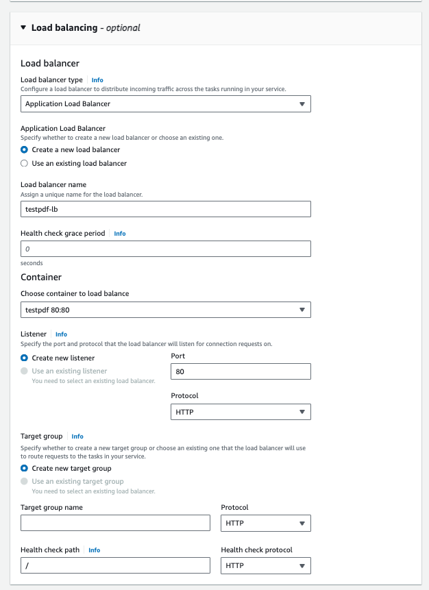
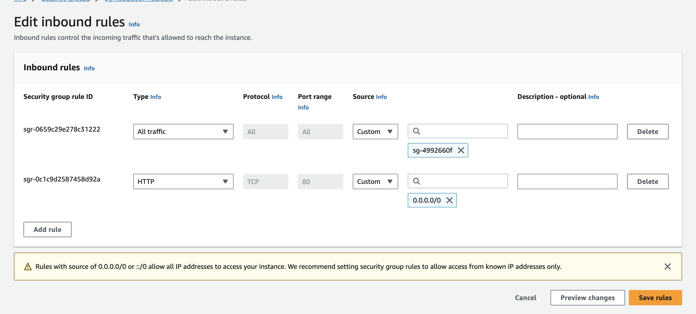

# AWS dotnetcore

## Create DockerFile, make sure "docker build" and "docker run" works
## Create buildspec.yml
## Create new repository in ECR

link https://us-east-1.console.aws.amazon.com/ecr/create-repository

Options: 
- Private
- Repository name is projects name (testpdf)
- everything else as default

## Create Pipeline using CodePipeline

### Step #1 - Choose pipeline settings

options:
- Pipeline name = project name
- if first time, create `new service role`
  - use defaults for role name
  - check `Allow AWS CodePipeline to create a service role so it can be used with this new pipeline`
- click `Next`

### Step #2 - Add source Stage

- Source provider: `Github v1`
- Select project repository
- Select project main branch
- in Change detection options, use `AWS CodePipeline`

### Step #3 - Add build stage

- Build Provider: `AWS CodeBuild`
- Region: `US East (N. Virginia)`
- Project name: `Create project`

#### Create Build project | CodeBuild

- Project name: testpdf

##### Environment

- Environment Image: `Managed image`
- Operating system: `Ubuntu`
- Runtime `Standard`
- Image: latest available ( atm latest is `aws/codebuild/standard:7.0`)
- Image version: `Always use the latest image for this runtime version`
- Environment type: `Linux EC2`
- Privileged: `check`
- Service role: if first time, choose `New service role` (codebuild-testpdf-service-role)
- Additional configuration: Here we leave everything as default and we add env vars that we are using in our buildspec project 

env vars example:

```
AWS_DEFAULT_REGION=us-east-1
AWS_ACCOUNT_ID=086414240535
IMAGE_REPO_NAME=testpdf
IMAGE_TAG=latest
CONTAINER_NAME=testpdf
```

- build specifications: `Use a buildspec file`
- cloudwatch logs: `check`
- `Continue to CodePipeline`

Before continue to Step #4, we go to IAM in another tab and look for the recently created role for codebuild, it should be named like `codebuild-<project>-service-role`.

- Open it
- click in add permissions
- search for `AmazonEC2ContainerRegistryFullAccess`
- click `Add permissions`
- now we can go back to CodePipeline and we proceed with `Next`

### Step #4 - Add deploy stage

- `Skip deploy stage`

### Step #5 - Review

- `Create pipeline`

## Try build in pipeline

Go to [CodePipeline](https://us-east-1.console.aws.amazon.com/codesuite/codepipeline/pipelines) and select your pipeline.

If you see `Source` and `Build` stages working, we are good to go to [ECS](https://us-east-1.console.aws.amazon.com/ecs/v2/clusters?region=us-east-1) setup.

## Elastic Container Service (ECS)

First we go to [ECS](https://us-east-1.console.aws.amazon.com/ecs/v2/clusters?region=us-east-1) and click on `Create cluster`.

### Cluster configuration

- Cluster name: `testpdf`

### Infrastructure

- check AWS Fargate (serverless)

Click `Create` button.

### Task definitions

Go to [task def site](https://us-east-1.console.aws.amazon.com/ecs/v2/create-task-definition?region=us-east-1) and create a new `Task definition`.

- Task definition family: testpdf-task
- Launch type: AWS Fargate
- OS: Linux/x86_64
- CPU: .5 vCpu
- Memory: 1GB
- Container Details
  - name: testpdf
  - Image URI: Go to ECR and copy your repo URI, add suffix `:latest` so we can specify version.
- Port mapping: set whatever port docker is exposing, dotnet apps expose port 80

Click `Create` and now you will see your Task at version 1: `testpdf-task:1`

Go back to your cluster in `Tasks` tab and click `Run new task` button

### Create Task

- Compute Options: `Capacity provider strategy`
- Capacity provider strategy: `Use custom (Advanced)`
- Capacity provider: `Fargate`, base `0`, Weight `1`
- Platform version: `Latest`

#### Deployment configuration

- Application type: Service
- Task definition: uncheck Specify the revision manually
- Family: `testpdf-task`
- Revision: `1 (LATEST)`
- Service name: `testpdf-service`
- Desired tasks: 1

Leave Networking, Service Connect as default

#### Load Balancing

- Load balancer type: `Application Load Balancer`
- Application Load Balancer: Create a new load balancer
- Load balancer name: `testpdf-lb`



#### Security groups




